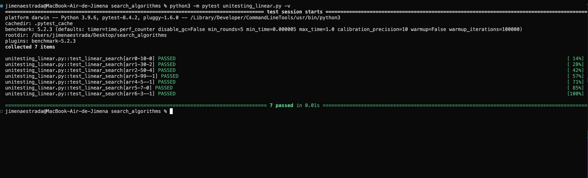
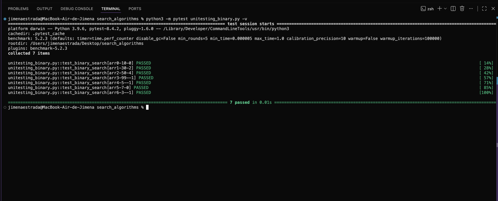
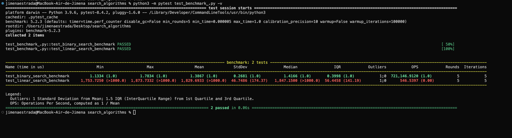

# search_algorithms

Este repositorio contiene la implementación y pruebas de dos algoritmos de búsqueda: búsqueda lineal y búsqueda binaria. Para obtener el código, clona el repositorio y entra a la carpeta:

git clone https://github.com/jimenaestradad/search_algorithms.git

cd search_algorithms
 ⁠

Para correr los unit tests, primero instala pytest con 

pip install pytest pytest-benchmark ⁠o en mcbook pip3 install pytest pytest-benchmark

luego ejecuta cada archivo de test por separado:

pytest test_linear_search.py -v  o en mcbook python3 -m pytest unitesting_linear.py -v
pytest test_binary_search.py -v o en mcbook python3 -m pytest unitesting_binary.py -v
 ⁠

Para correr el benchmarking, que evalúa el rendimiento de cada algoritmo buscando un elemento que no existe en una lista de 100,000 elementos:

pytest test_benchmark_linear.py -v o en mcbook python3 -m pytest test_benchmark_.py -v
pytest test_benchmark_binary.py -v o en mcbook python3 -m pytest test_benchmark_.py -v
 ⁠

